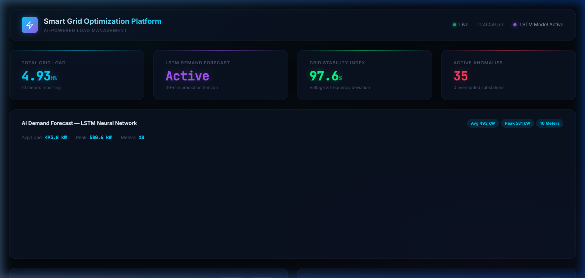
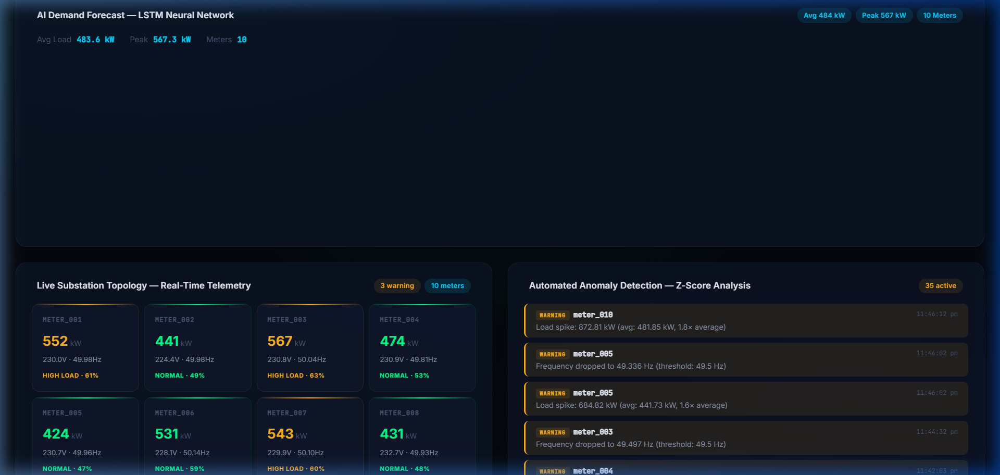

# React Dashboard

**Files:**
- `frontend/src/App.jsx` — Main layout + polling logic
- `frontend/src/components/DemandChart.jsx` — Real-time line chart
- `frontend/src/components/GridMap.jsx` — Meter status cards
- `frontend/src/components/AlertPanel.jsx` — Anomaly alert feed
- `frontend/src/index.css` — Design system

The React dashboard is a **single-page application** that polls the FastAPI backend every 5 seconds and renders three visualization panels.





*(You can also view a live recording format locally at `./assets/dashboard_demo.webp`)*

---

## Data Polling Architecture

The dashboard uses a simple **polling** pattern (not WebSockets) to keep data fresh:

```jsx
// In App.jsx
export default function App() {
  const [liveData, setLiveData] = useState([]);
  const [forecastData, setForecastData] = useState(null);
  const [alerts, setAlerts] = useState([]);

  const fetchLiveData = useCallback(async () => {
    try {
      const res = await fetch(`${API_BASE}/api/grid/live`);
      const data = await res.json();
      setLiveData(data.meters || []);
      setIsConnected(true);
    } catch (err) {
      setIsConnected(false);
    }
  }, []);

  useEffect(() => {
    // Fetch immediately on mount
    fetchLiveData();
    fetchForecast();
    fetchAlerts();

    // Then poll every 5 seconds
    const interval = setInterval(() => {
      fetchLiveData();
      fetchForecast();
      fetchAlerts();
    }, 5000);

    return () => clearInterval(interval);  // Cleanup on unmount
  }, [fetchLiveData, fetchForecast, fetchAlerts]);
```

**Why polling instead of WebSockets?** For this use case, 5-second polling is simpler and sufficient. WebSockets would add complexity (reconnection logic, state sync) for minimal benefit — the sensor data updates every 10 seconds anyway.

**Why `useCallback`?** Without it, the `fetchLiveData` function would be recreated on every render, causing the `useEffect` to re-run its interval setup. `useCallback` memoizes the function so the effect only runs once.

---

## Component 1: DemandChart

**What it shows:** A line chart with two lines — **Actual Demand** (blue, solid) and **Predicted Demand** (purple, dashed).

```jsx
<ComposedChart data={chartData}>
  {/* Gradient fill under the actual demand line */}
  <defs>
    <linearGradient id="actualGradient" x1="0" y1="0" x2="0" y2="1">
      <stop offset="0%" stopColor="#00d4ff" stopOpacity={0.3} />
      <stop offset="100%" stopColor="#00d4ff" stopOpacity={0} />
    </linearGradient>
  </defs>

  {/* Area fill (the colored region under the line) */}
  <Area
    type="monotone"
    dataKey="actual"
    fill="url(#actualGradient)"
    stroke="none"
  />

  {/* The actual line */}
  <Line
    type="monotone"
    dataKey="actual"
    stroke="#00d4ff"
    strokeWidth={2.5}
    dot={false}                    // No dots on each data point
    name="Actual Demand"
  />

  {/* Predicted line (dashed) */}
  <Line
    type="monotone"
    dataKey="predicted"
    stroke="#a855f7"
    strokeDasharray="8 4"          // 8px dash, 4px gap
    dot={{ r: 3, fill: '#a855f7' }}
    name="Predicted Demand"
  />
</ComposedChart>
```

**Why `ComposedChart` instead of `LineChart`?** We need both `<Area>` (gradient fill) and `<Line>` (the actual line) on the same chart. `ComposedChart` supports mixing different chart types.

### Stats Bar

Above the chart, we display aggregate statistics:

```jsx
const stats = useMemo(() => {
  if (!liveData || liveData.length === 0) return null;
  const totalLoad = liveData.reduce((s, m) => s + m.load_kw, 0);
  const avgLoad = totalLoad / liveData.length;
  const peakLoad = Math.max(...liveData.map((m) => m.load_kw));
  return { totalLoad, avgLoad, peakLoad };
}, [liveData]);  // Only recalculate when liveData changes
```

**`useMemo`** caches the calculation so it doesn't run on every render — only when `liveData` actually changes.

---

## Component 2: GridMap

**What it shows:** A grid of cards, one per meter, color-coded by utilization level.

### Status Classification

```jsx
const CAPACITY_KW = 900;

function getStatus(loadKw) {
  const utilization = loadKw / CAPACITY_KW;
  if (utilization > 0.85) return 'red';    // 🔴 Overloaded
  if (utilization > 0.60) return 'amber';  // 🟡 High load
  return 'green';                           // 🟢 Normal
}
```

### Color-Coded Card

Each card uses CSS classes based on status:

```jsx
<div className={`meter-card meter-card--${status}`}>
  <div className="meter-card__id">{meter.meter_id}</div>
  <div className={`meter-card__load meter-card__load--${status}`}>
    {meter.load_kw.toFixed(0)}
    <span className="meter-card__unit"> kW</span>
  </div>
</div>
```

In the CSS, overloaded cards get a **pulsing red glow**:

```css
.meter-card--red {
  border-color: rgba(255, 59, 92, 0.2);
  animation: redPulse 2s ease-in-out infinite;
  box-shadow: 0 0 24px rgba(255, 59, 92, 0.25);
}

@keyframes redPulse {
  0%, 100% { box-shadow: 0 0 12px rgba(255, 59, 92, 0.1); }
  50% { box-shadow: 0 0 24px rgba(255, 59, 92, 0.25); }
}
```

This visual cue immediately draws the operator's eye to problem areas.

---

## Component 3: AlertPanel

**What it shows:** A scrollable list of anomaly alerts, color-coded by severity.

```jsx
function AlertItem({ alert }) {
  const severity = alert.severity || 'warning';

  return (
    <div className={`alert-item alert-item--${severity}`}>
      <div className="alert-item__header">
        <span className="alert-item__meter">
          {/* Severity badge */}
          <span className={`alert-item__severity alert-item__severity--${severity}`}>
            {severity}
          </span>
          {alert.meter_id}
        </span>
        <span className="alert-item__time">{formatTime(alert.time)}</span>
      </div>
      <div className="alert-item__message">{alert.message}</div>
    </div>
  );
}
```

### Auto-scroll to Latest

```jsx
const bodyRef = useRef(null);

useEffect(() => {
  if (bodyRef.current) {
    bodyRef.current.scrollTop = 0;  // Scroll to top (newest alerts first)
  }
}, [alerts]);  // Triggered whenever alerts array changes
```

### Slide-in Animation

New alerts appear with a slide-in effect:

```css
@keyframes alertSlideIn {
  from {
    opacity: 0;
    transform: translateX(-10px);
  }
  to {
    opacity: 1;
    transform: translateX(0);
  }
}

.alert-item {
  animation: alertSlideIn 0.3s ease-out;
}
```

---

## Design System (`index.css`)

The CSS uses a **design token** approach with CSS custom properties:

```css
:root {
  /* Colors */
  --bg-primary: #060a14;              /* Deep space navy */
  --bg-card: rgba(15, 23, 42, 0.65); /* Semi-transparent for glass effect */
  --accent-blue: #00d4ff;            /* Electric blue for primary actions */
  --accent-green: #00ff88;           /* System OK indicators */
  --accent-red: #ff3b5c;             /* Critical alerts */

  /* Glass effect */
  --glass-blur: 16px;
  --glass-border: 1px solid rgba(255, 255, 255, 0.06);
}
```

### Glassmorphism Cards

```css
.glass-card {
  background: var(--bg-card);                          /* Semi-transparent */
  backdrop-filter: blur(var(--glass-blur));            /* Blur content behind */
  -webkit-backdrop-filter: blur(var(--glass-blur));   /* Safari support */
  border: var(--glass-border);                         /* Subtle white edge */
  border-radius: var(--radius-lg);
  box-shadow: var(--shadow-card);
}
```

**Glassmorphism** creates a frosted glass effect by blurring the background behind a semi-transparent element. It's a modern design trend that adds depth without being heavy.

### Ambient Background

The body has subtle radial gradients that give a sense of depth:

```css
body::before {
  content: '';
  position: fixed;
  inset: 0;
  background:
    radial-gradient(ellipse 80% 60% at 20% 10%, rgba(0, 212, 255, 0.04) 0%, transparent 60%),
    radial-gradient(ellipse 60% 50% at 80% 90%, rgba(168, 85, 247, 0.03) 0%, transparent 60%);
  pointer-events: none;  /* Don't block clicks */
  z-index: 0;
}
```

---

## API Connection Configuration

The React app reads the API URL from an environment variable at build time:

```jsx
const API_BASE = import.meta.env.VITE_API_URL || 'http://localhost:8000';
```

When served through nginx (in Docker), the nginx config proxies `/api/*` requests to the backend, so the frontend can use relative paths. The environment variable fallback to `localhost:8000` is for local development outside Docker.

---

## Layout Structure

```
┌────────────────────────────────────────────────────────┐
│  Smart Grid Optimization       Live  AI Model Active │  Header
├────────────────────────────────────────────────────────┤
│                                                        │
│  Demand Overview    Total: 5,420 kW                   │
│  ┌──────────────────────────────────────────────────┐ │
│  │     Actual ━━━━    Predicted ┄┄┄┄               │ │  DemandChart
│  │  kW                                              │ │
│  │   │     ╭━━╮         ┄┄┄┄                       │ │
│  │   │━━━━╯  ╰━━━━                                 │ │
│  │   └──────────────── Time ──────                  │ │
│  └──────────────────────────────────────────────────┘ │
│                                                        │
├────────────────────────────┬───────────────────────────┤
│  Grid Topology             │  Anomaly Alerts           │
│ ┌─────┬─────┬─────┬─────┐ │ ┌───────────────────────┐│
│ │ 001 │ 002 │ 003 │ 004 │ │ │ ! meter_003 load spike││
│ │ 540 │ 672 │ 890 │ 320 │ │ │ ! meter_007 freq low  ││  GridMap + AlertPanel
│ │ O.K.│ Warn│ Crit│ O.K.│ │ │ ! meter_001 voltage   ││
│ ├─────┼─────┼─────┼─────┤ │ │                       ││
│ │ 005 │ 006 │ 007 │ 008 │ │ │                       ││
│ │ ... │ ... │ ... │ ... │ │ │                       ││
│ └─────┴─────┴─────┴─────┘ │ └───────────────────────┘│
└────────────────────────────┴───────────────────────────┘
```
